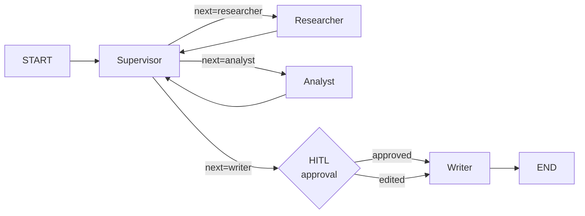

# langgraph-ts-agents

> Production-grade TypeScript port of LangGraph supervisor/worker patterns — streaming-first, with side-by-side Python references.

Most LangGraph.js examples are weakly-typed single-agent chatbots. This repo ports the supervisor + workers + HITL pattern from a Python LangGraph course (Cert_3) to **strict TypeScript** with `Annotation.Root` state, Zod-validated tools, and streaming-first execution.

## Quickstart

```bash
git clone https://github.com/AleSZanello/langgraph-ts-agents
cd langgraph-ts-agents
pnpm install
cp .env.example .env  # add OPENAI_API_KEY or ANTHROPIC_API_KEY
pnpm dev "Draft a market summary for LangGraph.js adoption"
```

You'll see streaming node events scroll past: supervisor routing → researcher → analyst → HITL prompt → writer → done.

## Demo flow



The supervisor inspects state, decides the next worker, and routes via `Command<typeof GraphState.State>`. Workers append their findings and return control. The writer is gated by a human-in-the-loop approval node — when the supervisor routes there, execution **interrupts** until you `Command.resume(...)`.

## From Python to TypeScript

This repo is a deliberate port of patterns from the [Edureka Agentic AI Engineering specialization](https://www.coursera.org/account/accomplishments/specialization/V20XQMM270EL) (Cert_3 Module 3 supervisor pattern). Here's how the concepts translate:

| Concept | Python (course) | TypeScript (this repo) |
|---|---|---|
| Typed state | `class State(MessagesState): next: str` | `Annotation.Root({ messages, next, votes })` |
| Reducer for message list | `Annotated[List, operator.add]` | `Annotation<BaseMessage[]>({ reducer: messagesReducer })` |
| Routing decision | `Command(goto=choice.lower())` | `Command<typeof GraphState.State>` |
| Supervisor parsing | `response.content.strip().upper()` | `withStructuredOutput(z.object({ next: z.enum([...]) }))` |
| Checkpointer | `SqliteSaver` | `MemorySaver` (or `SqliteSaver` from `@langchain/langgraph-checkpoint-sqlite`) |
| Run | `app.invoke({...})` | `graph.stream({...}, { streamMode: "updates" })` |
| HITL | `interrupt(...) + Command.resume(...)` | `interrupt(...) + Command.resume(...)` (identical API) |

## Streaming-first

The default `pnpm dev` command runs `graph.stream()` with `streamMode: "updates"` and renders each node event to the terminal. The Python course only used blocking `invoke()` — this repo treats streaming as the default execution model.

## Tests (offline)

```bash
pnpm test
```

Tests use `FakeListChatModel` so they run offline in CI without any API key.

## Optional: Hono SSE demo

`examples/hono-server` (TBD) wraps the graph in a tiny Hono HTTP server that streams events over SSE — useful as a reference for wiring LangGraph.js into a Next.js or Hono backend.

## License

MIT — see [LICENSE](./LICENSE).

---

Built by [Ale Zanello](https://azanello.com) — Agentic AI & GenAI Engineer.
